# Students-Managenment-Project

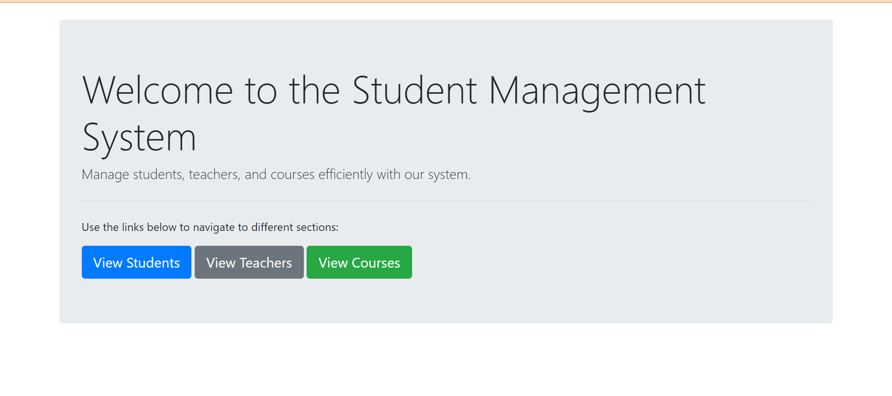

## Overview

The Student Management System is a comprehensive tool for managing key school functions. It includes sections for Students, Teachers, and Courses, allowing you to add and manage detailed records for each. Students' details, teachers' information, and course specifics can all be efficiently tracked and updated. This system streamlines administrative tasks, providing a centralized solution for managing school data.

## Table of Contents

- [Features](#features)
- [Installation](#installation)
- [Usage](#usage)


## Features

- **Student Management:** Add, edit, and delete student information with ease. Includes fields like name, address, and contact details.
- **Teacher Management:** Assign teachers to courses, and manage teacher details in a streamlined interface.
- **Course Management:** Create, edit, and delete courses, with the ability to associate each course with a teacher. View the course list and related details dynamically.
- **Responsive Design:** The project is designed to be mobile-friendly, ensuring smooth operation across different screen sizes.
- **Search Functionality:** Easily search for courses, students, or teachers with integrated search features.


## Installation

1. Clone the repository:

    ```bash
    git clone https://github.com/yourusername/your-repository.git
    ```

2. Navigate to the project directory:

    ```bash
    cd your-repository
    ```

3. Install dependencies:

    ```bash
    composer install
    ```

4. Set up environment variables:

    ```bash
    cp .env.example .env
    ```

5. Generate an application key:

    ```bash
    php artisan key:generate
    ```

6. Run migrations:

    ```bash
    php artisan migrate
    ```

## Usage

Provide instructions on how to use your project. Include code examples and configuration details if necessary.

### Running Locally

To start the development server, use:

```bash
php artisan serve
```


### Instructions

#### **Students Section**
Contains details about Students in the system. You can Edit details, View and Delete any specific Student's field.

Students List

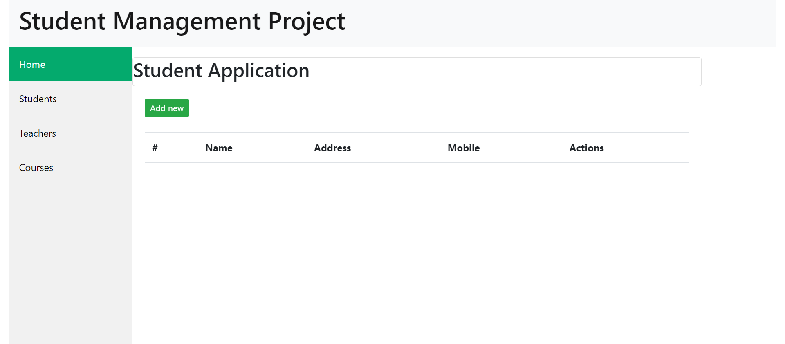

Add New Student

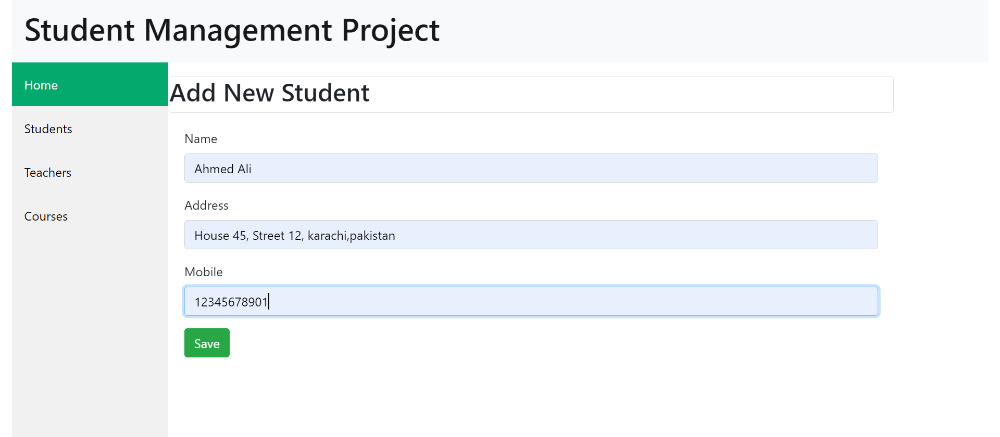

Student Added

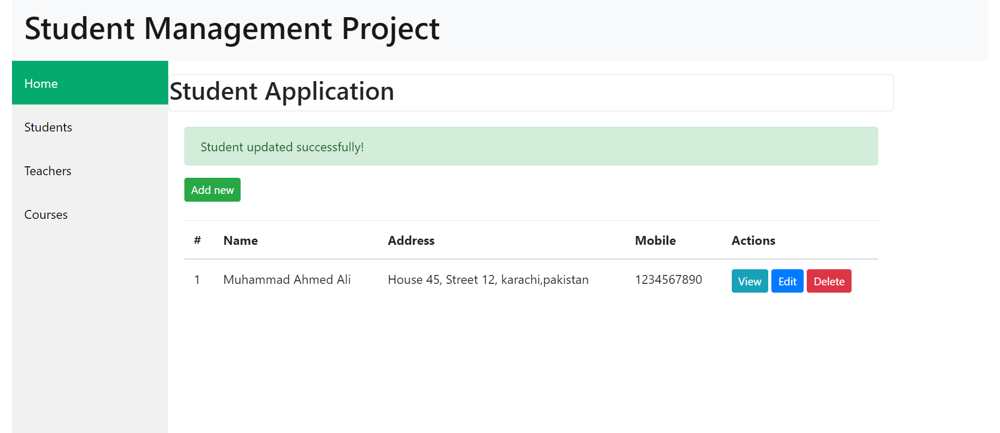

#### Teachers Section
Contains details about Teachers in the system. You can Edit details, View and Delete any specific Teacher's field.

Teachers List

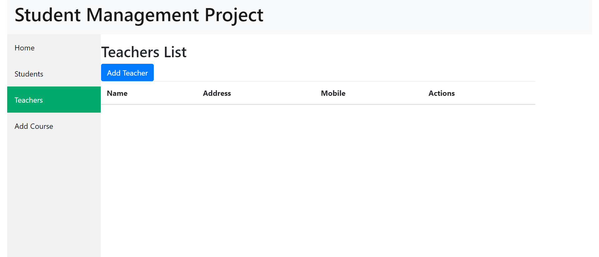

Add Teacher

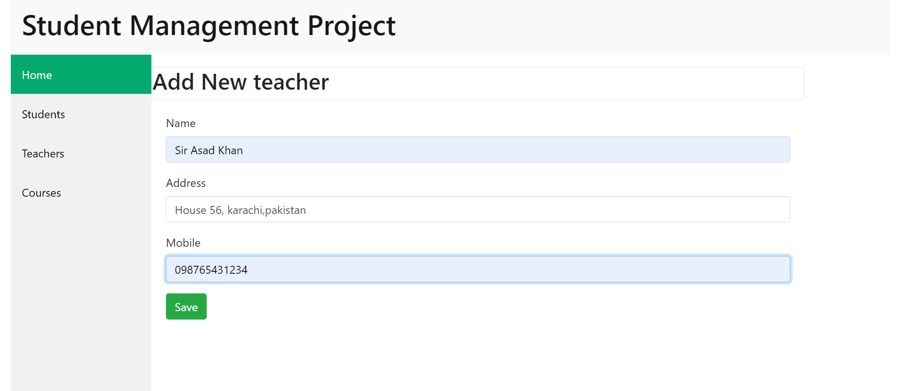

Edit Teacher

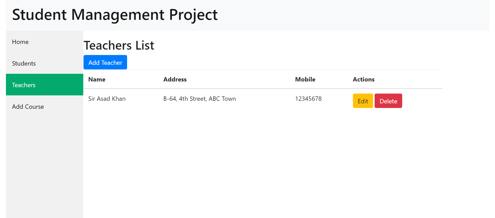

#### Courses Section 
Contains details about Course Program. You can Add Course, select specific Teacher and Class.

Courses List

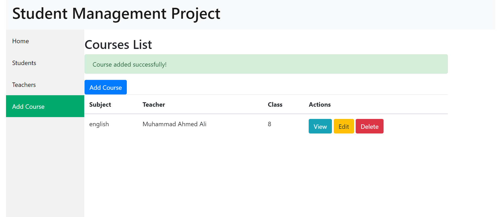

Add Course

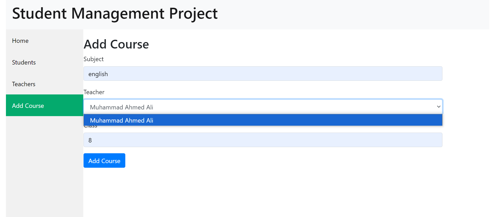

Edit Course

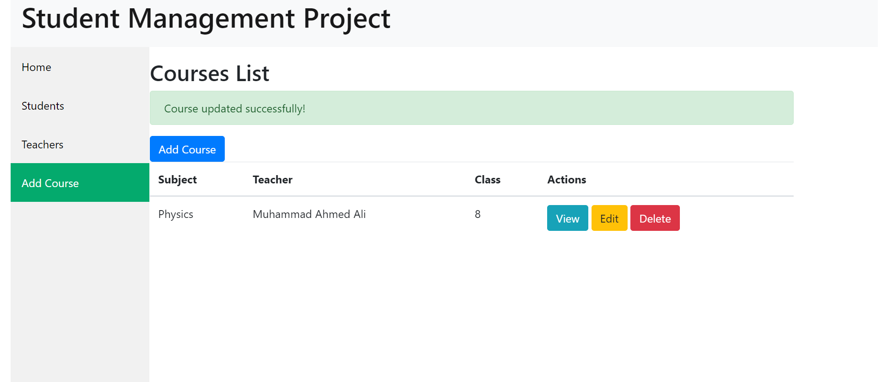

Course Details

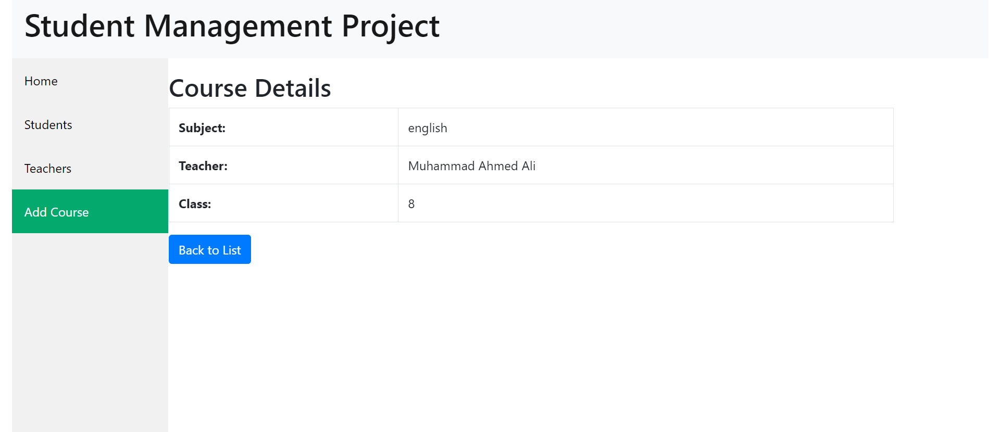


## License
This project is open-source and available under the MIT License.

